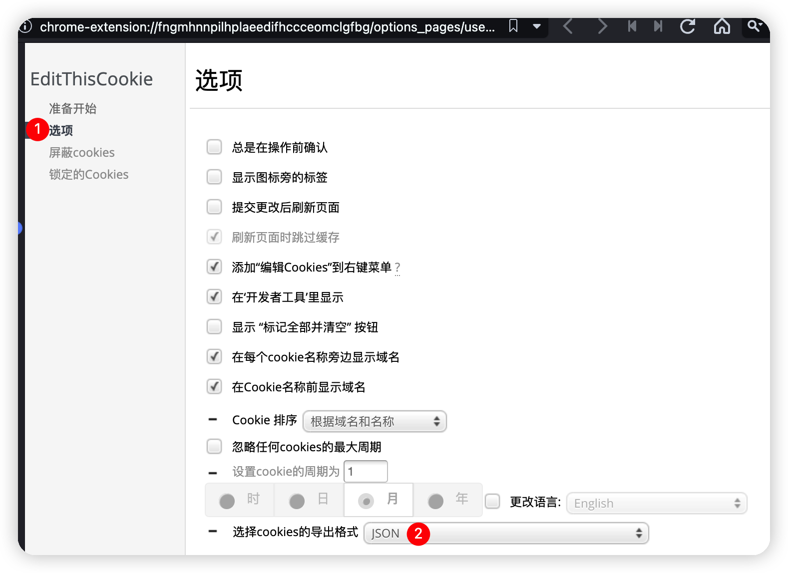

# 网易buff利润报表软件使用教程


## 1.安装chrome浏览器

如果已经安装了，可以忽略此步骤，如果没有安装，这里有下载地址

https://www.iplaysoft.com/tools/chrome/

不建议使用其他浏览器

## 2.安装EditThisCookie浏览器扩展

EditThisCookie扩展在线安装页面

https://chrome.google.com/webstore/detail/editthiscookie/fngmhnnpilhplaeedifhccceomclgfbg?hl=zh-CN

软件安装包也带有离线EditThisCookie.crx扩展文件，可参考如下教程进行离线安装

https://www.iplaysoft.com/p/chrome-install-crx

## 3.设置EditThisCookie

点击浏览器右上角一个类似小饼干的按钮，如下图红圈1处


然后再点击红圈2处的小扳手，进入设置界面



点击"选项"标签页，如上图红框1处所示
将"选择cookies的导出格式"设置为"JSON"即可，如上图红框2处所示

以上步骤在一个浏览器中只需要设置一次，后面就不需要再次设置了

## 3.导出网易buff cookies

浏览器登录buff页面成功后，再次点击EditThisCookie扩展按钮

注意：一定要在buff页面上点击，不要在其他页面点击


然后点击上图所框2处的按钮，此时cookies就复制到剪贴板中了

打开程序目录中的"cookies_buff.txt"，如果里面有内容，将其清空，将刚才剪贴板中的内容粘帖进去就可以了

## 3.导出steam cookies

浏览器登录[steam页面](https://steamcommunity.com)成功后，再次点击EditThisCookie扩展按钮，如下图图1所示


**注意：域名必须是steamcommunity.com，而不能是steampowered.com**

然后点击上图所框2处的按钮，此时cookies就复制到剪贴板中了

打开程序目录中的"cookies_steam.txt"，如果里面有内容，将其清空，将刚才剪贴板中的内容粘帖进去就可以了

## 5.编辑config.txt文件

**http代理端口**
```
httpProxy: -1
```
0则表示不使用代理，直接走系统直连网络，UU加速器模式三，steamcommunity 302或steam++加速器可以使用此模式

-1则表示自动使用本地浏览器代理，相当于读取chrome或IE浏览器的代理配置，一般商用代理使用此模式

其他正数代表手动设置本地代理端口号，高级玩家可以使用此模式

**interval：下单时间间隔**

默认是1秒钟，通常情况下不需要修改


**卡价exchange**

如果需要计算出精准的利润，请填写真实的卡价

如果只需要看大概的趋势的，可以不用那么精准


**buff交易记录的开始时间和buff交易记录的截止时间**


如果是最近30天的交易，可以直接进入“我的出售”-->“出售统计”，看下图的交易时间即可


如果时间大于30天，可以直接进入“我的出售”-->“出售记录”，不断地翻页，获取交易的开始和结束时间


**注意：交易的开始和结束时间其实并不需要太精确，精确到天甚至月份都可以**

**程序会自动判断buff中的饰品与steam中的饰品是否相匹配，如果不匹配会自动跳过**

举例说明：

2022年1月buff一共绑定了两个steam账号

第一个账号销售了300件饰品，第二个账号销售了400件饰品

交易的开始和结束时间可以直接设置为2023-01-01 00:00:00和2023-02-01 00:00:00

导出的是第一个steam账号的cookies，那程序的报表中就只会包含300件饰品，非常智能

时间范围可以适当调大一些，但不能调小，调小会导致报表不全
